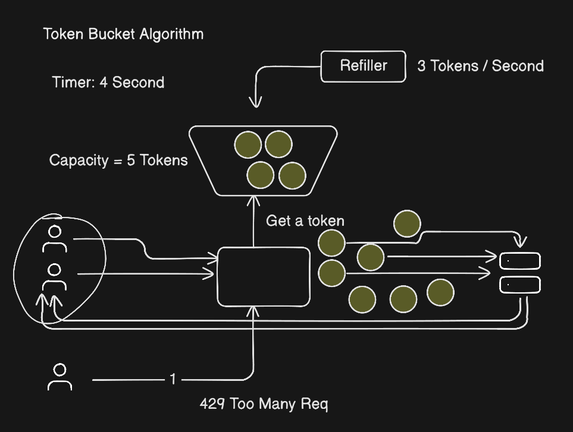
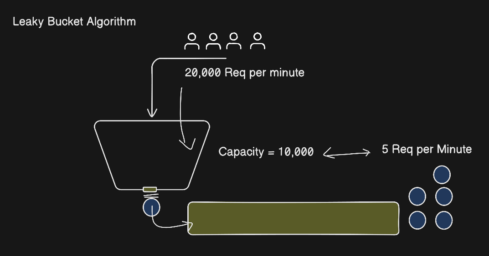

✅ 1. Token Bucket (Most used in industry)

Idea:

**Components : Bucket , Token**

- A bucket stores tokens , Tokens refill at a fixed rate (leaky tap)

- Requests consume tokens

- If bucket empty → reject

Pros:

Handles brust trafic , Very efficient , majorly used in industry

> Handling burst means: Being able to serve many requests instantly if capacity allows

Used by: AWS, Google Cloud, Nginx

Cons:

Slightly more complex as you have to select 2 params : bucket size and refill rate of bucket

✅ 2. Leaky Bucket

Idea:

**Components : Bucket , processing queue**

- Queue of fixed size

- Requests leak out at a fixed rate

- If queue full → drop incoming requests

Pros:
no sudden memory spikes even if there is brust trafic as the rate will be that only at what the bucket leaks 

Cons:

cant handle brust traffic ( as queue can process that much only what you set , in case of brust the extra req are dropped ) , good if traffic are stable and consistently coming . Also if the queue contains old req they will process first and the new req will wait . 

✅ 3. Fixed Window Counter  [ kabhi use nhi hota except for pet projects as fundamentally wrong in edges ]

Simplest rate limiter.

Idea: Time is divided into fixed windows (1 sec, 2 sec or 1 min)

what to do :
Maintain a req counter for each user in a map
on incoming user req , check the curr time - start time <= window size time ,
if no , remove userid from map , reset start time to curr time

at end
If count > req limit → return false

Pros:

Simple & fast (O(1)) , Easy to implement , not accurate

Cons:

fundamentlly wrong , at edges there can be 2*size of the counter can occur

✅ 4. Sliding Window Log

Idea: Store timestamps of each request in a queue/log

Remove old timestamps continuously

Size of queue = number of requests in last X seconds

Pros:

More accurate than type 3 ( fixed window counter )

Cons:

High memory usage for large traffic

Expensive inserts/deletes

✅ 5. Sliding Window Counter [ not implemented in LLD but is used in place of the 3 , 4 ]

Hybrid of fixed window counter + sliding window log

Idea:

Use two windows: current & previous

Weighted calculation → smoothes traffic

Pros:

Less bursty than fixed window

Lower memory than sliding log

Cons:

Still approximate

